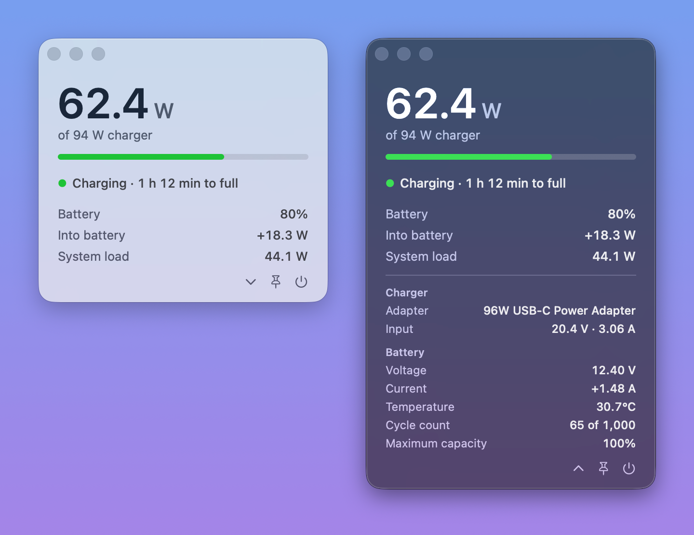

# Charging

[](LICENSE)


A small native macOS window that shows how much power your MacBook is taking from its charger, along with the battery status and system load, updated every second.

<p align="center">
  
</p>

> **About this project:** a purely personal project I made out of curiosity, just to see my Mac's charging info. Most of the code and docs were written by Claude (Anthropic's AI assistant) using Claude Code.

## What it shows

- **Power in** (the large number): the watts the Mac is drawing from the charger. Below it are the charger's rating ("of 94 W charger") and a bar showing how much of that rating is in use.
- **Status**: a colored dot and a short line. When a plugged-in Mac isn't charging, the line says so, with the reason when macOS gives one, for example "On hold at 80% · Optimized Battery Charging". When macOS has an estimate, it also gives the time to full or the time left. See [Status meanings](#status-meanings).
- **Battery**: the charge level, the same percentage as in the menu bar.
- **Into battery**: the power going into the battery. It's negative when the battery is helping to power the Mac.
- **System load**: the total power the Mac is using.

On battery, the large number is the power drawn from the battery instead, and the bar, Into battery and System load are hidden.

The charger rating is the figure macOS negotiated with the charger, so it can be a little under the number on the adapter: a 96 W adapter shows as 94 W.

**Details.** The chevron button opens a details section with two groups:

- **Charger**, shown only while plugged in: the adapter's name, such as "96W USB-C Power Adapter", and its live input in volts and amps.
- **Battery**: voltage, current (negative when discharging), temperature (°C or °F, as set in Language & Region), cycle count against the rated count ("65 of 1,000"), and maximum capacity compared with when the battery was new.

## Features

- **Live.** The watts update every second, and unplugging shows up within a second.
- **Native look.** A frosted-glass window that follows the system's light or dark appearance.
- **Details on demand.** Opening the details grows the window downward, keeping its top edge in place.
- **Keep on top.** The window can be pinned above other windows on the current Space.
- **Stays in the Dock.** Closing the window keeps the app running; click its Dock icon to bring the window back.
- **Idle when out of sight.** Nothing is read while the window is closed, minimized, hidden or fully covered.

## Requirements

- A MacBook with Apple Silicon. Tested on an M4 Pro MacBook Pro running macOS 26.
- [uv](https://docs.astral.sh/uv/). `Battery.py` declares its Python version and its one dependency, PyObjC, in an inline metadata block (PEP 723). On the first run, uv finds or downloads Python 3.14 or newer and installs PyObjC, so that run needs an internet connection and takes a little longer. Later runs reuse uv's cache.

## Usage

```sh
git clone https://github.com/Eeeeqyq/Charging-APP.git
cd Charging-APP
uv run Battery.py
```

`python3 Battery.py` works too: when that Python doesn't have PyObjC, the script relaunches itself with `uv run`.

Each launch opens the window centered, with the details closed and the pin off. The buttons at the bottom right, from left to right:

- **Chevron** (⌄, or ⌃ while open): shows or hides the details.
- **Pin**: keeps the window above other windows.
- **Power**: quits the app.

You can also quit with ⌘Q, with Quit in the Dock icon's menu, or with Ctrl+C in the terminal that started it. Closing that terminal quits the app too.

## How it works

Everything is in one file, `Battery.py`, which uses AppKit through PyObjC.

| Shown | Source | Read |
| --- | --- | --- |
| Power in, system load, battery power, and the details' charger input and battery voltage and current | SMC keys `PDTR`, `PSTR`, `B0AC`, `B0AV`, `VD0R`, `ID0R` | Every second |
| Status, battery %, time estimates, charger rating and name, temperature, cycle count, maximum capacity | `ioreg -rw0 -a -c AppleSmartBattery` | Every 5 seconds, and right after the charger is plugged in or unplugged |
| Why the charge is on hold | `pmset -g battlimit` | At most once a minute, while the charge is held at a limit |

- The SMC (System Management Controller) is read through IOKit's `AppleSMC` service with `ctypes`. It needs no `sudo`, and only read commands are sent, so nothing is changed. Battery power is the battery's current (`B0AC`, mA) times its voltage (`B0AV`, mV). The charger's input is `VD0R` (volts) and `ID0R` (amps).
- Whether the charger is connected comes from `PDTR` (above 0.5 W), so unplugging shows up within a second, before ioreg reports it.
- macOS refreshes the ioreg values only about once a minute, so the status, percentage and time estimates change at that pace.
- Maximum capacity is ioreg's `BatteryData.MaxCapacity`, because it matched System Information's Maximum Capacity; ratios of ioreg's raw capacity values came out lower.
- If the SMC can't be read, the app falls back to ioreg for the watts and for the battery's voltage and current, hides the charger's input, and shows "Updated N s ago" at the bottom left, since ioreg's figures can be up to a minute old.

## Status meanings

The dot, and the bar under the large number, take the status color.

| Status | Color | Meaning |
| --- | --- | --- |
| Charging · 1 h 12 min to full | Green | Plugged in and charging. The time appears when macOS has an estimate. |
| Fully charged | Green | Plugged in with a full battery. |
| On hold at 80% · Optimized Battery Charging | Orange | Plugged in but not charging. When macOS is holding the charge at a limit, the reason follows: "Optimized Battery Charging" or "Charge limit". |
| Plugged in · Charger too weak, using battery | Orange | Plugged in, but the Mac uses more power than the charger supplies, so the battery drains. |
| On battery · 4 h 30 min left | Gray | Not plugged in. The time appears when macOS has an estimate. |
| Plugged in | Gray | Shown for a moment after plugging in, until ioreg reports the charger. |

On a Mac without a battery the window only says "No battery found", and it says "Can't read battery data" if ioreg fails.

## Limitations

- **Apple Silicon MacBooks only.** The power telemetry it reads exists only on Apple Silicon, and desktop Macs have no battery.
- **Undocumented interfaces.** The SMC keys and the `pmset -g battlimit` output aren't documented by Apple, so a macOS update could change or remove them. Without the SMC, the app falls back to ioreg's once-a-minute figures.
- **Not fully verified.** The sign of the SMC battery current (`B0AC`) is assumed to be negative while discharging, like ioreg's, but it hasn't been checked on a charging or discharging Mac yet; if it's reversed, Into battery and Current show the wrong sign. Maximum capacity matched System Information at 100%, but it hasn't been compared on a more worn battery.
- **App name.** The Dock and menu bar show "Charging" only when uv runs a framework build of Python, such as Homebrew's. Otherwise they show "python".

## License

Released under the [MIT License](LICENSE).
